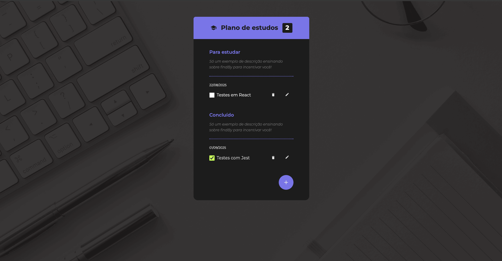

# Study Checklist App Testing

A comprehensive project designed for developers who have a solid foundation in web technologies (HTML, CSS, JavaScript) and basic ReactJS knowledge, but who want to elevate their application quality to the next level. This project demonstrates how to write unit, component, and E2E tests for a React application, providing both practical experience and theoretical understanding of how testing improves code quality and team productivity.

## 🔨 Project Features

- Unit testing best practices and implementation
- Component and integration testing strategies
- End-to-End (E2E) testing with real browser automation
- Advanced testing techniques: Mocks, Stubs, and Spies
- Code coverage analysis and visualization
- Productivity optimization with npm scripts and snippets



## ✔️ Techniques and Technologies

This project covers the following essential techniques and technologies:

- **Test Pyramid:** A methodology for organizing and prioritizing different types of tests for maximum efficiency.
- **Jest:** A comprehensive JavaScript testing framework for unit and integration tests.
- **React Testing Library:** A powerful tool for testing React components with a user-centric approach.
- **Cypress:** Modern E2E testing framework for writing and executing browser-based tests.
- **Mocks, Stubs, and Spies:** Techniques for simulating dependencies and isolating code under test.
- **Code Coverage:** Metrics to measure the percentage of code covered by tests.
- **False Positives Prevention:** Understanding and avoiding misleading test results.
- **npm Scripts & Snippets:** Practical tips and tools to boost your development productivity and efficiency.

## 🛠️ Getting Started

Follow these steps to set up and run the project locally:

1. **Install Node.js**: Make sure you have Node.js installed ([official guide](https://nodejs.org/en/download/)).
1. **Install Dependencies**: Navigate to the project folder and run:

```bash
npm install
```

1. **Start the Development Server**:

```bash
npm start
```

1. **Access the Application**: Open your browser and go to [http://localhost:5173](http://localhost:5173) (powered by Vite).
